# มาเขียนโปรแกรมบน Blockchain กัน

### 1.Browser solidity
* เปิดเว็บไซต์ [Browser solidity](https://ethereum.github.io/browser-solidity) จากลิงค์ใน Workshop 3


### 2.Multiplication.sol
* เปิดไฟล์ตัวอย่าง `Multiplication.sol` ที่อยู่ในโฟร์เดอร์ examples


`Multiplication.sol`
```
contract Multiplication {

    int _multiplier;
    event Multiplied(int indexed a, address indexed sender, int result );

    function Multiplication(int multiplier) {
        _multiplier = multiplier;
    }

    function multiply(int a) returns (int r) {
       r = a * _multiplier;
       Multiplied(a, msg.sender, r);
       return r;
    }
}
```
* แล้วทำการเพิ่ม function ด้านล่างเข้าไป
```
function setMul(int multiplier) public {
    _multiplier = multiplier;
}
```
Code หลังจากที่ทำการแก้ไขแล้ว
```
contract Multiplication {

    int _multiplier;
    event Multiplied(int indexed a, address indexed sender, int result );

    function Multiplication(int multiplier) {
        _multiplier = multiplier;
    }

    function multiply(int a) returns (int r) {
       r = a * _multiplier;
       Multiplied(a, msg.sender, r);
       return r;
    }
    
    function setMul(int multiplier) public {
        _multiplier = multiplier;
    }
}
```

### 3.WEB3DEPLOY
* ทำการ copy code จากข้อไฟล์ `Multiplication.sol` มาใส่ใน `Browser solidity`  
    * ทำการกดปุ่ม `Detail`  
    * เลื่อนไปที่หมวด `WEB3DEPLOY` แล้วทำการ copy code ที่ได้มาไว้ 
    * ทำการแก้ไข code บรรทัด /* var of type int256 here */ ให้เป็นตัวเลขที่เราชอบ (ในตัวอย่างจะใส่เลข 5)

Code ที่ได้จาก `WEB3DEPLOY` (ยังไม่ได้แก้ไข)
```
var multiplier = /* var of type int256 here */ ;
var multiplicationContract = web3.eth.contract([{"constant":false,"inputs":[{"name":"a","type":"int256"}],"name":"multiply","outputs":[{"name":"r","type":"int256"}],"payable":false,"stateMutability":"nonpayable","type":"function"},{"constant":false,"inputs":[{"name":"multiplier","type":"int256"}],"name":"setMul","outputs":[],"payable":false,"stateMutability":"nonpayable","type":"function"},{"inputs":[{"name":"multiplier","type":"int256"}],"payable":false,"stateMutability":"nonpayable","type":"constructor"},{"anonymous":false,"inputs":[{"indexed":true,"name":"a","type":"int256"},{"indexed":true,"name":"sender","type":"address"},{"indexed":false,"name":"result","type":"int256"}],"name":"Multiplied","type":"event"}]);
var multiplication = multiplicationContract.new(
   multiplier,
   {
     from: web3.eth.accounts[0], 
     data: '0x608060405234801561001057600080fd5b5060405160208061019e8339810180604052810190808051906020019092919050505080600081905550506101548061004a6000396000f30060806040526004361061004c576000357c0100000000000000000000000000000000000000000000000000000000900463ffffffff1680631df4f14414610051578063e91d862014610092575b600080fd5b34801561005d57600080fd5b5061007c600480360381019080803590602001909291905050506100bf565b6040518082815260200191505060405180910390f35b34801561009e57600080fd5b506100bd6004803603810190808035906020019092919050505061011e565b005b60008054820290503373ffffffffffffffffffffffffffffffffffffffff16827f841774c8b4d8511a3974d7040b5bc3c603d304c926ad25d168dacd04e25c4bed836040518082815260200191505060405180910390a3809050919050565b80600081905550505600a165627a7a723058205ffe2162815a32bd62d164ad9e0d09cf0d53756ad48460042f88a75e723d01f50029', 
     gas: '4700000'
   }, function (e, contract){
    console.log(e, contract);
    if (typeof contract.address !== 'undefined') {
         console.log('Contract mined! address: ' + contract.address + ' transactionHash: ' + contract.transactionHash);
    }
 })
 ```

Code ที่ได้จาก `WEB3DEPLOY` (แก้ไขแล้ว)
```
var multiplier = 5 ;
var multiplicationContract = web3.eth.contract([{"constant":false,"inputs":[{"name":"a","type":"int256"}],"name":"multiply","outputs":[{"name":"r","type":"int256"}],"payable":false,"stateMutability":"nonpayable","type":"function"},{"constant":false,"inputs":[{"name":"multiplier","type":"int256"}],"name":"setMul","outputs":[],"payable":false,"stateMutability":"nonpayable","type":"function"},{"inputs":[{"name":"multiplier","type":"int256"}],"payable":false,"stateMutability":"nonpayable","type":"constructor"},{"anonymous":false,"inputs":[{"indexed":true,"name":"a","type":"int256"},{"indexed":true,"name":"sender","type":"address"},{"indexed":false,"name":"result","type":"int256"}],"name":"Multiplied","type":"event"}]);
var multiplication = multiplicationContract.new(
   multiplier,
   {
     from: web3.eth.accounts[0], 
     data: '0x608060405234801561001057600080fd5b5060405160208061019e8339810180604052810190808051906020019092919050505080600081905550506101548061004a6000396000f30060806040526004361061004c576000357c0100000000000000000000000000000000000000000000000000000000900463ffffffff1680631df4f14414610051578063e91d862014610092575b600080fd5b34801561005d57600080fd5b5061007c600480360381019080803590602001909291905050506100bf565b6040518082815260200191505060405180910390f35b34801561009e57600080fd5b506100bd6004803603810190808035906020019092919050505061011e565b005b60008054820290503373ffffffffffffffffffffffffffffffffffffffff16827f841774c8b4d8511a3974d7040b5bc3c603d304c926ad25d168dacd04e25c4bed836040518082815260200191505060405180910390a3809050919050565b80600081905550505600a165627a7a723058205ffe2162815a32bd62d164ad9e0d09cf0d53756ad48460042f88a75e723d01f50029', 
     gas: '4700000'
   }, function (e, contract){
    console.log(e, contract);
    if (typeof contract.address !== 'undefined') {
         console.log('Contract mined! address: ' + contract.address + ' transactionHash: ' + contract.transactionHash);
    }
 })
 ```

### 4.Putty
* ทำการดาวโหลดโปรแกรม putty มาเก็บไว้  [https://www.chiark.greenend.org.uk/~sgtatham/putty/latest.html](https://www.chiark.greenend.org.uk/~sgtatham/putty/latest.html)

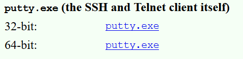

### 5.เชื่อมต่อไปยัง Server
* เข้าไปที่ Azure แล้วเลือก Resource group ที่เราได้ทำการสร้าง Blockchain cluster ไว้
* เมื่อเข้ามาแล้วให้กด Deployments 6 Successded

* เลือกตัวที่ชื่อขึ้นต้นด้วย Microsoft
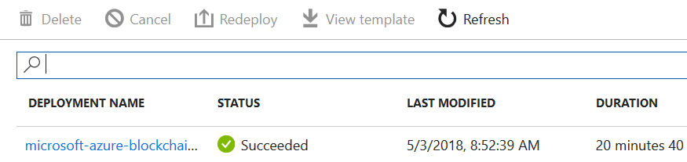
* เมื่อเข้ามาแล้วให้คลิกไปที่ tab `Outputs`
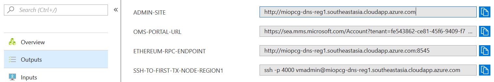
* ที่ tab `Outputs` จะมีรายการที่ชื่อว่า `ssh-to-first-tx-node-region1` อยู่ด้านขวามือให้ทำการ copy ไปใส่ใน text editor แล้ว copy เฉพาะ URL ของเซิฟเวอร์ไว้
* เปิดโปรแกรม `Putty` ที่ดาวโหลดไว้จากข้อ 4 ขึ้นมา
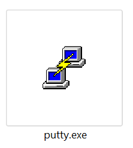
* ในช่อง `Host Name (or IP address)` ให้ใส่ URL ของเซิฟเวอร์ลงไป และ `Port` ลงไปแล้วทำการกดปุ่ม `Open` เพื่อทำการเชื่อมต่อกับเซิฟเวอร์
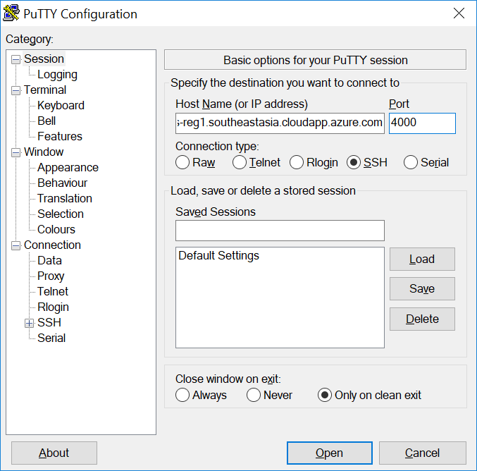
* โปรแกรมจะมีหน้าต่าง Alert ขึ้นมา ให้ตอบ `Yes`
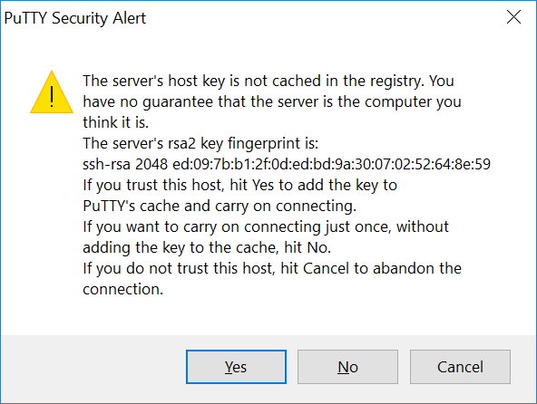
* เมื่อเข้ามาแล้วเซิฟเวอร์จะถามให้เรา login โดยให้ทำการพิมพ์ password ที่ได้ตั้งไว้ตอนสร้าง Blockchain cluster (ตอนใส่ password เราจะไม่เห็นตัวอักษรที่เราพิมพ์อยู่)
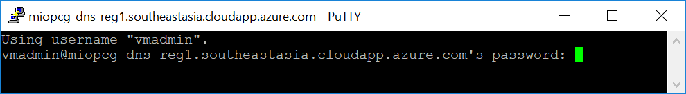
* หน้าต่างเมื่อ login สำเร็จ เมื่อเจอหน้านี้แสดงว่าเราได้เข้ามาในเซิฟเวอร์ Blockchain ของเราแล้ว
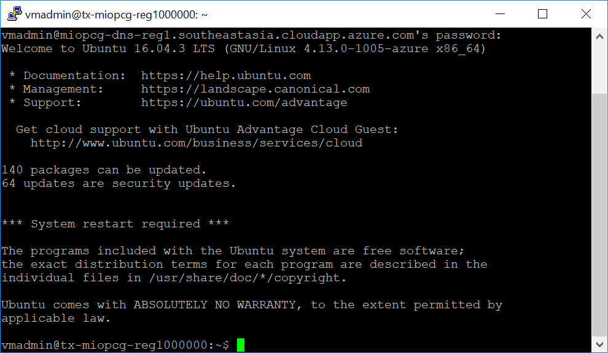

### 6.นำ code ของเราเข้าไปใส่ Blockchain
* ทำการใช้คำสั่ง `geth attach` เพื่อให้เราสามารถใช้คำสั่งต่างๆต่อไปได้
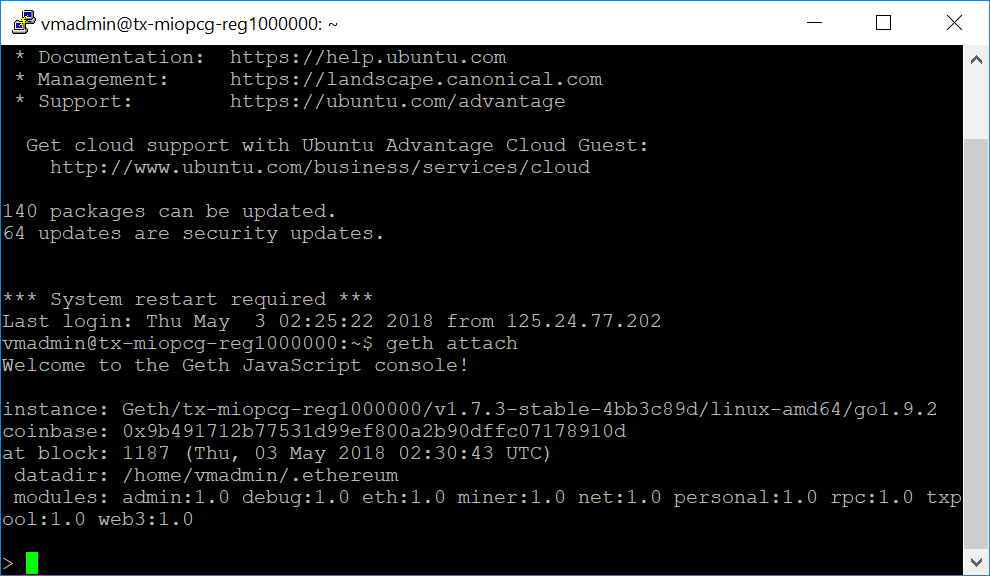
* จากขั้นตอนที่ 3 `WEB3DEPLOY` ให้ทำการ copy code ที่เราได้ทำการแก้ไขแล้วมาใส่แล้วกด enter
* ระบบจะแจ้ง error ขึ้นมา เนื่องจากเรายังไม่ได้ทำการปลด lock account ที่กำลังดำเนินการคำสั่งนี้ (เราอาจจะได้พบปัญหานี้บ่อยๆเนื่องจากมันเป็น security ของระบบ)
```
Error: authentication needed: password or unlock undefined
```
* เพื่อทำการปลด lock account โดยใช้คำสั่งตามตัวอย่างด้านล่าง แล้วโปรแกรมจะถามให้เราใส่ password อีกครั้ง
```
personal.unlockAccount(eth.accounts[0])
```
* ถ้ายืนยันรหัสผ่านถูกต้องระบบจะแจ้งกลับมาเป็น `true` นั่นหมายความ account ของเราถูกปลด lock แล้ว ดังนั้นให้ทำการนำ code จากขั้นตอนที่ 3 `WEB3DEPLOY` มาวางแล้วกด enter ต่อได้เลย
* เมื่อรอสักพักเซิฟเวอร์จะตอบกลับมาคล้ายๆกับข้อความด้านล่าง (address แต่ละคนจะไม่เหมือนกัน) นั่นหมายความว่าโปรแกรมที่เราเขียนได้ถูกเอาไปเก็บใน Blockchain เรียบร้อยแล้ว
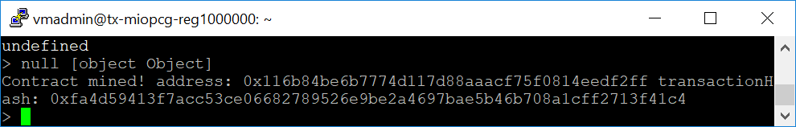

### 7.เรียกใช้ Function (multiply) 
* หลังจากที่นำ code ของเราเข้าไปใส่ใน Blockchain แล้ว คราวนี้เราก็จะเรียกใช้ function ของเราโดยใช้คำสั่งตาม code ด้านล่าง
```
multiplication
```
* เซิฟเวอร์จะแสดงรายละเอียดของ multiplication ของเราออกมาให้ดู ซึ่งในนั้นจะมี function ที่ชื่อว่า multiply
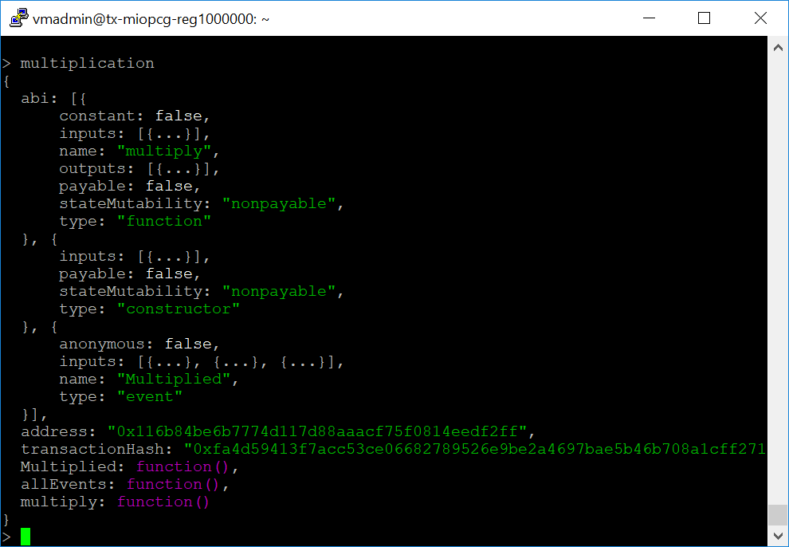
* ทำการเรียกใช้ function `multiply` โดย function นั้นจะต้องส่งตัวเลขเข้าไปด้วย (ในตัวอย่างนี้จะใส่เลข 7 ลงไป) ตาม code ตัวอย่างด้านบ่าง
```
multiplication.multiply.call(7)
```
* เซิฟเวอร์จะตอบผลลัพท์กลบมาเป็น 35 เนื่องจาก function multiply จะนำตัวเลขที่เราใส่เข้ามาไปคูณกับตัวเลขที่เราตั้งไว้ (ซึ่งตัวเลขที่เราตั้งไว้ในขั้นตอนที่ 3 คือ 5)

### 8.เรียกใช้ Function (setMul)
* คราวนี้เราจะมาลองเรียกใช้ function `setMul` กันดูบ้าง ซึ่งเจ้า function นี้ถ้าจะเรียกใช้จะต้องกำหนดค่าตัวเลขให้มัน ซึ่งในตัวอย่างเราจะส่งเลข  9 ไป โดยใช้คำสั่งตามตัวอย่างด้านล่างนี้
```
multiplication.setMul.sendTransaction(9, {from: eth.accounts[0]})
```
* จะเห็นว่าการเรียกใช้ function `setMul` จะไม่สามารถเรียกใช้จาก `.call` ตรงๆได้ เนื่องจากคำสั่ง `.call` จะใช้กับ function ที่ไม่มีการเปลี่ยนแปลงข้อมูล แต่ในขณะที่ function `setMul` จะทำการแก้ไขตัวแปร `_multiplier` ซึ่งการที่จะแก้ข้อมูลใน Blockchain ได้เราจะต้องทำการเขียน block แล้วนำไป chain เสียก่อน เราเลยต้องสั่งด้วยคำสั่ง `sendTransaction` แทน
* หลังจากที่เราดำเนินการเสร็จให้ลองเรียกใช้ function `multiply` ใหม่อีกครั้งจะเห็นว่าผลลัพท์เปลี่ยนเป็น 63 แล้ว เนื่องจากเราเปลี่ยนค่าตัวคูณให้เป็น 9 ไปแล้ว
```
multiplication.multiply.call(7)
```
